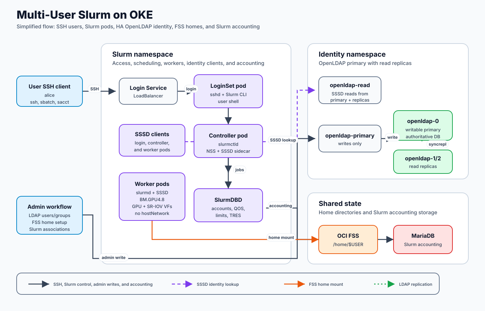

# Product Requirements Document: Multi-User Slurm on OKE

Status: Draft  
Date: 2026-05-07  
Owner: TBD  
Target platform: Slurm Operator on Oracle Kubernetes Engine (OKE)

## Summary

Provide a traditional multi-user Slurm experience on Kubernetes-backed OKE
clusters.

Users should SSH to a Slurm login endpoint as themselves, land in their own FSS
home directory, submit jobs with normal Slurm commands, and have Slurm and
SlurmDBD accounting record the real submitting user. The implementation must
preserve shape-specific GPU and RDMA architecture on OKE. The validated shapes
are `BM.GPU4.8` with SR-IOV/VF pod networking and `BM.GPU.GB200.4` with the
currently tested `hostNetwork` worker path. The newer `BM.GPU.GB300.4`
hostNetwork path is also validated for HA OpenLDAP, FSS homes, accounting,
`AutoDetect=nvml`, NVIDIA IMEX/DRA, Topograph OCI topology discovery, and
multi-node NCCL jobs. AMD/ROCm support is in preparation: the ROCm/PyTorch
Slurm worker image has been built and pushed, but it is not yet validated on an
AMD OKE cluster.

The preferred production identity model is LDAP, FreeIPA, or Active Directory
through SSSD. If LDAP must run inside Kubernetes, the recommended production
shape is HA OpenLDAP with one writable primary and read replicas. A no-LDAP
local-user path can remain as a small-cluster fallback and test path, but it is
not the recommended production design.

## Problem

The current Kubernetes-native Slurm deployment can run Slurm workloads, but a
cluster intended for multiple human users needs the same identity, home
directory, SSH, and accounting behavior that users expect from a traditional
bare-metal Slurm installation.

The main gaps are:

- Linux identity must be consistent across login and compute pods.
- SSH access must authenticate real users, not root.
- `/home/$USER` must be shared across login and compute via OCI FSS.
- Users must not be able to list or read other users' homes.
- Slurm jobs must show the submitting user, not root or an operator identity.
- SlurmDBD associations, limits, QOS, and accounting must work.
- Operator-side commands in the controller should optionally resolve usernames,
  not only numeric UIDs.

## Goals

- Give users a familiar Slurm access model: `ssh user@login`, then `sbatch`,
  `squeue`, `sacct`, `srun`.
- Use a shared LoginSet as the normal access path.
- Use SSSD with LDAP, FreeIPA, or AD for production POSIX identity.
- When LDAP is hosted inside Kubernetes, use an HA OpenLDAP StatefulSet design
  with one writable primary, read replicas, TLS, backup/restore, and explicit
  promotion runbooks.
- Mount OCI FSS at `/home` in login and compute pods.
- Enforce home directory isolation with POSIX permissions.
- Preserve OKE GPU/RDMA requirements by shape: `BM.GPU4.8` uses SR-IOV/VF pod
  networking with no `hostNetwork`; `BM.GPU.GB200.4` currently uses the tested
  `hostNetwork` path, arm64 worker image, and worker sshd on port `2222`; and
  `BM.GPU.GB300.4` uses the tested hostNetwork path with IMEX/DRA and
  topology-aware Slurm placement options.
- Enable SlurmDBD accounting and account/user associations.
- Provide clear onboarding, offboarding, key rotation, and account-sync
  workflows.
- Document and support a tested fallback path for small clusters without LDAP.

## Non-Goals

- Replace Slurm with Kubernetes-native job submission for users.
- Use `kubectl exec` as the primary user workflow.
- Require one login pod per user for the default design.
- Build a full identity provider product.
- Solve high-performance shared scratch storage for training datasets.
- Provide per-user Kubernetes namespaces as the primary isolation boundary.

## Users and Personas

HPC user:

- SSHs into the login service.
- Uses normal Slurm CLI commands.
- Expects `$HOME` to follow them from login to jobs.
- Expects jobs, accounting, and errors to show their username.

Cluster administrator:

- Installs and upgrades Slurm on OKE.
- Configures identity, FSS, accounting, GPU/RDMA, and access control.
- Onboards users and maps identity groups to Slurm accounts.
- Troubleshoots jobs from login, worker, controller, and accounting pods.

Security or platform administrator:

- Requires stable UID/GID assignment.
- Requires auditable authentication and authorization.
- Requires users to be isolated from other users' homes.
- Requires a clear offboarding and key rotation process.

## Product Scope

### MVP

The MVP is a production-ready multi-user path with:

- one shared LoginSet;
- LDAP, FreeIPA, or AD identity through SSSD;
- SSH public key authentication through SSSD;
- FSS-backed `/home`;
- per-user home directory permissions;
- SSSD-backed user resolution in login pods;
- SSSD-backed user resolution in worker pods;
- SSSD/NSS-backed user resolution in the controller pod for administrator and
  controller-side Slurm commands;
- SlurmDBD accounting with user/account associations;
- GPU jobs that record the real user and account;
- shape-specific worker values that preserve the tested network mode and GPU
  autodetect behavior for each supported OKE GPU shape.

### Post-MVP

- First-class chart and image support for controller SSSD/NSS, replacing the
  current custom-image and values-overlay implementation.
- Automated group-to-Slurm-account sync.
- Automated home provisioning.
- Optional per-user LoginSets for stronger login-node isolation.
- Production hardening for LDAPS, CA management, secret rotation, and
  identity-source failover.
- Per-job IMEX channel allocation if the NVIDIA DRA/IMEX stack and Slurm
  integration support that model cleanly.
- AMD/ROCm cluster validation, including AMD GPU Operator prerequisites, Slurm
  GPU discovery, RCCL/NCCL-equivalent workload tests, and accounting behavior.

## Current Validated State

The current OKE validation covers three shape-specific tracks.

`BM.GPU4.8` validation:

- two GPU workers are `BM.GPU4.8`;
- each worker exposes `nvidia.com/gpu: 8`;
- each worker exposes `nvidia.com/sriov-rdma-vf: 16`;
- worker pods use SR-IOV VF attachments and do not use `hostNetwork`;
- `AutoDetect=nvml` works when dynamic nodes register with NUMA-shaped
  topology: `CPUs=64`, `SocketsPerBoard=8`, `CoresPerSocket=8`,
  `ThreadsPerCore=1`, and `Parameters=numa_node_as_socket`;
- NCCL PMIx validation completed with 8 GPUs and 16 VFs per node.

`BM.GPU.GB200.4` validation:

- one GPU worker is `BM.GPU.GB200.4` and `arm64`;
- the tested worker path uses `hostNetwork`;
- worker sshd listens on port `2222` to avoid conflict with the host sshd;
- worker image is a multi-platform NVML-enabled image:
  `iad.ocir.io/idxzjcdglx2s/slinky:slurmd-nvml-core-25.11.5-ubuntu24.04`;
- `AutoDetect=nvml` detects 4 GB200 GPUs and Slurm registers
  `Gres=gpu:4(S:0-1)`;
- Slinky dynamic node registration uses the Kubernetes node name as the Slurm
  node name for the hostNetwork path.

`BM.GPU.GB300.4` validation:

- four GPU workers are `BM.GPU.GB300.4` and `arm64`;
- the tested worker path uses `hostNetwork`;
- worker sshd listens on port `2222` to avoid conflict with the host sshd;
- `AutoDetect=nvml` detects 4 GB300 GPUs per worker without static
  socket/core/thread configuration;
- HA OpenLDAP, SSSD, cert-manager LDAP TLS, FSS homes, MariaDB, SlurmDBD, and
  Slurm account associations were validated end to end;
- the `devin` demo validates SSH as a real LDAP user, `/home/devin` isolation,
  Slurm account association, job submission, accounting, and NCCL output;
- the current full worker image is
  `iad.ocir.io/idxzjcdglx2s/slinky:slurmd-nvml-nccl-25.11.5-ubuntu24.04-r2`;
- NVIDIA IMEX/DRA is validated with a shared `ComputeDomain` and
  `SwitchType=switch/nvidia_imex`;
- worker pods still request `nvidia.com/gpu: 4`; DRA is used for the IMEX
  channel, not for Slurm GPU allocation;
- 4-node, 16-GPU NCCL `all_reduce_perf` completed successfully through Slurm;
- topology experiments validated OCI label based topology and Topograph with
  the OCI provider as optional ways to generate Slurm topology data.

AMD/ROCm preparation:

- the ROCm GPU Operator Slinky example `slurmd` image was built and pushed:
  `iad.ocir.io/idxzjcdglx2s/slinky:slurmd-rocm-torch-24.05.7-rocm25.4-fa43b1ca-r1`;
- the image was built from `ROCm/gpu-operator` commit `fa43b1ca`, Docker target
  `slurmd`, parent `rocm/pytorch-training:v25.4`;
- local image smoke testing on `image-builder` validated Slurm 24.05.7,
  PyTorch import, HIP 6.3, and `rocm-smi`;
- this is not yet an OKE cluster validation. It should not be listed as a
  supported production AMD path until it is tested on the AMD node cluster.

Shared identity, home, and accounting validation:

- existing FSS PV `fss-pv` is bound to PVC `slurm-home`;
- `/home` is mounted in login and worker pods;
- `/home` mode `711` prevents directory listing by normal users;
- `/home/alice` mode `700` is owned by UID/GID `10001:10001`;
- `/home/bob` mode `700` is not readable by Alice where that test user exists;
- MariaDB and SlurmDBD accounting are running;
- `alice` is associated with Slurm account `project-a`;
- no-LDAP wrapper path was tested successfully;
- LDAP-backed SSSD path was tested successfully with disposable OpenLDAP;
- HA OpenLDAP-backed SSSD path was tested successfully end to end with `alice`;
- cert-manager-issued OpenLDAP CA and server certificates were validated in the
  GB200 HA OpenLDAP path;
- `alice` resolves through SSSD in login and worker pods without a local
  `/etc/passwd` entry;
- `alice` resolves through SSSD/NSS in the controller pod using the custom
  controller image and root SSSD sidecar;
- SSH as `alice` works through `sss_ssh_authorizedkeys`;
- GPU jobs submitted as `alice/project-a` allocate `gres/gpu`;
- `sacct` records the top-level Slurm job as `alice/project-a`.

Known limitation:

- controller-side NSS resolution currently depends on a custom controller image
  and an explicit SSSD sidecar in the values overlay. This is validated, but
  still needs first-class chart/image productization before it is a polished
  default.
- the GB200 HA OpenLDAP test validates LDAPS with cert-manager-generated
  certificates and SSSD CA trust. Production still needs certificate rotation,
  backup/restore, and primary promotion runbooks validated against the chosen
  production LDAP chart or manifest set.
- the current GB300 IMEX/DRA path creates a shared IMEX channel attached to the
  long-running worker pods. It does not create a separate IMEX channel per
  Slurm job.
- multiple independent jobs can overlap on one GB300 worker only when they
  request partial resources, including memory. A job that implicitly allocates
  all node memory blocks other jobs from sharing that worker even if GPU GRES
  remains available.
- AMD/ROCm image build is complete, but AMD Slurm-on-OKE deployment, GPU
  discovery, and RCCL workload validation are still pending.

## User Experience Requirements

### Login

P0 requirements:

- Users can SSH to a stable login service endpoint.
- Users authenticate as their own username.
- Users do not use root as their normal access path.
- Users land in `/home/$USER`.
- `whoami`, `id`, and `getent passwd $USER` show the expected user and UID/GID.
- SSH public keys can be sourced from LDAP, FreeIPA, or AD through SSSD.
- Password SSH is disabled unless explicitly enabled by policy.

Acceptance criteria:

```bash
ssh alice@<slurm-login-load-balancer>
whoami
id
pwd
getent passwd alice
```

Expected:

```text
alice
uid=10001(alice) gid=10001(alice)
/home/alice
alice:*:10001:10001:...:/home/alice:/bin/bash
```

### Slurm Job Submission

P0 requirements:

- Users can run `sinfo`, `sbatch`, `squeue`, `sacct`, and `scontrol` from the
  login pod.
- Jobs submitted from a user shell are owned by that user.
- Job working directory and output paths under `/home/$USER` work on compute
  pods.
- GPU jobs can request and receive `gres/gpu`.
- Slurm accounting records the real user and account.

Acceptance criteria:

```bash
sbatch --parsable --wait --account=project-a --gres=gpu:1 \
  --output=/home/alice/test-%j.out \
  --wrap="hostname; whoami; id; nvidia-smi -L"

sacct -j <jobid> --format=JobID,User,Account,State,ExitCode,AllocTRES,NodeList -P
```

Expected:

```text
User=alice
Account=project-a
State=COMPLETED
AllocTRES includes gres/gpu=1
```

### Home Directories

P0 requirements:

- OCI FSS is mounted at `/home` in all login pods and compute NodeSets.
- Each user has exactly one home path, `/home/$USER`.
- Per-user home directories are owned by stable numeric UID/GID values.
- Users cannot list all home directories.
- Users cannot read another user's home directory.

Required permissions:

```text
/home       root:root     711
/home/alice 10001:10001   700
/home/bob   10002:10002   700
```

Acceptance criteria:

```bash
ls -ld /home /home/alice /home/bob
ls /home
ls /home/bob
```

Expected for Alice:

- `ls -ld` shows ownership and mode;
- `ls /home` returns permission denied;
- `ls /home/bob` returns permission denied.

## Identity Requirements

### Production Identity

P0 requirements:

- Use SSSD with LDAP, FreeIPA, or Active Directory.
- If LDAP runs inside Kubernetes, use HA OpenLDAP with a single writable
  primary and read replicas rather than the disposable OpenLDAP test manifest.
- UID/GID values are stable and never reused while old files may exist.
- Login and worker pods resolve users through the same identity source.
- Controller pods resolve users through the same identity source when
  controller-side Slurm commands or accounting inspection need names instead of
  numeric IDs.
- Users can be authorized by identity group membership.
- SSH public keys can be returned by SSSD.
- Identity configuration is stored in Kubernetes Secrets, not ConfigMaps.

P1 requirements:

- SSSD config changes trigger pod rollout.
- Identity source supports LDAPS or StartTLS with CA validation.
- Bind credentials can be rotated without image rebuilds.
- Replica promotion and restore are documented and tested if OpenLDAP runs
  inside Kubernetes.

### LDAP TLS and CA Management

Current status:

- cert-manager is available in the OKE test cluster for Kubernetes certificate
  automation.
- The GB200 HA OpenLDAP validation uses cert-manager `Issuer` and
  `Certificate` resources for an OpenLDAP CA and server certificate.
- OpenLDAP pods mount the cert-manager TLS Secret and serve LDAPS on port `636`.
- SSSD uses `ldaps://openldap-readonly.identity.svc.cluster.local:636` and
  `ldaps://openldap.identity.svc.cluster.local:636` with
  `ldap_tls_reqcert = demand` and `ldap_tls_cacert = /etc/sssd/ca/ca.crt`.

P0 production requirements:

- Production LDAP traffic from Slurm SSSD clients to the identity source uses
  LDAPS or StartTLS, not plaintext LDAP.
- If OpenLDAP runs inside Kubernetes, cert-manager is the default
  Kubernetes-native mechanism for issuing and rotating LDAP server
  certificates.
- The LDAP certificate covers every DNS name used by SSSD and admin clients,
  including:
  - `openldap-0.openldap-headless.identity.svc.cluster.local`;
  - `openldap-1.openldap-headless.identity.svc.cluster.local`;
  - `openldap-2.openldap-headless.identity.svc.cluster.local`;
  - `openldap-primary.identity.svc.cluster.local`;
  - `openldap-read.identity.svc.cluster.local`.
- OpenLDAP pods mount the server certificate, private key, and CA bundle from
  Kubernetes Secrets.
- OpenLDAP config enables TLS for client traffic and replication traffic.
- SSSD clients mount the trusted LDAP CA bundle and set `ldap_tls_cacert`.
- SSSD uses either `ldaps://...` URIs or StartTLS with
  `ldap_id_use_start_tls = true`.
- Certificate rotation causes predictable reload or rollout of affected
  OpenLDAP and Slurm SSSD pods.

P1 requirements:

- Certificate expiration is monitored.
- CA rotation supports a dual-trust window so existing and new LDAP server
  certificates can both be trusted during migration.
- Production deployments can use either an in-cluster cert-manager CA Issuer or
  an enterprise/private CA issuer, depending on platform security policy.

Acceptance criteria:

```bash
kubectl -n identity get issuer,clusterissuer,certificate
kubectl -n identity get secret <ldap-tls-secret>
kubectl -n slurm exec <login-pod> -c login -- grep -E 'ldap_uri|ldap_id_use_start_tls|ldap_tls_cacert' /etc/sssd/sssd.conf
kubectl -n slurm exec <login-pod> -c login -- getent passwd alice
```

Expected:

```text
LDAP Certificate is Ready=True
SSSD uses ldaps://... or StartTLS
SSSD has ldap_tls_cacert configured
alice resolves through SSSD with TLS enabled
```

### Small-Cluster Fallback

P1 requirements:

- A no-LDAP path can create local users in login and slurmd containers.
- UID/GID registry is stored in Git or another authoritative source.
- The fallback clearly documents drift, offboarding, and scaling limitations.

Non-production warning:

- The local-user wrapper does not give the controller consistent identity.
- It is acceptable for testing and small clusters, but not preferred for
  production.

## Slurm Accounting Requirements

P0 requirements:

- SlurmDBD is enabled.
- MariaDB is deployed and persistent.
- `AccountingStorageEnforce=associations,limits,qos` can be enabled.
- Every Slurm user has at least one account association.
- Users can submit jobs with valid accounts.
- Jobs without valid associations are rejected when enforcement is enabled.
- `sacct` shows user, account, state, exit code, elapsed time, node list, and
  GPU TRES.

P1 requirements:

- Identity groups are synced to Slurm accounts.
- Group membership changes converge to SlurmDBD associations.
- Default account selection is automated.
- QOS and limits can be mapped from groups.

## Kubernetes and OKE Requirements

P0 requirements:

- Worker NodeSet values are explicitly shape-specific.
- `BM.GPU4.8` workers use `node.kubernetes.io/instance-type: BM.GPU4.8`.
- `BM.GPU4.8` worker pods request and limit `nvidia.com/gpu: 8`.
- `BM.GPU4.8` worker pods request and limit `nvidia.com/sriov-rdma-vf: 16`.
- `BM.GPU4.8` worker pods use the `sriov-rdma-vf` NetworkAttachmentDefinition
  and do not use `hostNetwork`.
- `BM.GPU.GB200.4` workers use
  `node.kubernetes.io/instance-type: BM.GPU.GB200.4`.
- `BM.GPU.GB200.4` worker pods request and limit `nvidia.com/gpu: 4`.
- `BM.GPU.GB200.4` worker images include `linux/arm64` support.
- `BM.GPU.GB200.4` uses the currently tested `hostNetwork` path and moves the
  worker container sshd to port `2222`.
- `BM.GPU.GB300.4` workers use
  `node.kubernetes.io/instance-type: BM.GPU.GB300.4`.
- `BM.GPU.GB300.4` worker pods request and limit `nvidia.com/gpu: 4`.
- `BM.GPU.GB300.4` worker images include `linux/arm64` support.
- `BM.GPU.GB300.4` uses the currently tested `hostNetwork` path and moves the
  worker container sshd to port `2222`.
- GB300 IMEX/DRA values attach the DRA `ComputeDomain` claim to worker pods
  without replacing Slurm's `gres/gpu` scheduling model.
- `/dev/infiniband` is preserved.
- `/dev/shm` is preserved.
- FSS PVC `slurm-home` is mounted at `/home`.

P0 operational caution:

- Helm values list merging must be handled carefully. Do not apply a small
  overlay that replaces `volumeMounts` or `volumes` and drops RDMA or FSS
  mounts.

## Topology Requirements

P1 requirements:

- Support Slurm Operator topology propagation for worker NodeSet pods.
- Kubernetes nodes can carry `topology.slinky.slurm.net/spec` annotations that
  map the scheduled worker pod to Slurm topology names.
- A matching `topology.yaml` can be supplied through Slurm config files so
  Slurm can place multi-node jobs with topology awareness.
- On OKE GPU/RDMA clusters, topology should represent real placement domains
  such as RDMA leaf, network block, or HPC island when those labels are
  available.
- Topology support must preserve each shape's tested network mode. It must not
  remove SR-IOV VFs from the `BM.GPU4.8` path, and it must not require static
  socket/core/thread values except where they are explicitly part of a validated
  shape-specific GPU autodetect configuration.
- For GB300 and similar large GPU fabrics, topology can be supplied manually,
  from existing OCI/Kubernetes node labels, or from Topograph with the OCI
  provider.
- Topograph is optional for the current IMEX/DRA plumbing. Its value is
  generating and updating Slurm topology data as nodes are added, removed, or
  relabeled.
- When Slurm 25.11 topology block support is used, `TopologyParam=BlockAsNodeRank`
  should be validated with the target job launcher so rank ordering matches the
  intended local block or network-block grouping.

Related implementation docs:

- `slurm-operator/docs/usage/topology.md`
- `guides/slurm-operator/deploying-slinky-on-oke.md`
- `slurm-operator/docs/usage/oke-gb300-topograph-topology.md`
- `slurm-operator/docs/usage/oke-gb300-topology-block-test-log.md`

## IMEX and DRA Requirements

Current status:

- GB300 validation uses NVIDIA DRA to create an IMEX `ComputeDomain`.
- Slurm workers attach the DRA claim while continuing to expose GPUs to Slurm
  through `gres/gpu`.
- Slurm is configured with `SwitchType=switch/nvidia_imex`.
- The current implementation uses one shared IMEX channel across the worker
  pods participating in the ComputeDomain.

P0 requirements for GB300:

- IMEX/DRA setup must not replace or bypass Slurm job ownership, accounting, or
  GPU GRES allocation.
- The DRA claim must be visible on the worker pods expected to run IMEX/NCCL
  jobs.
- NCCL jobs launched through Slurm must be able to discover GPUs, IMEX channel
  state, and RDMA devices from inside the job.
- IMEX/DRA overlays must be shape-specific and must not be applied to
  `BM.GPU4.8` SR-IOV/VF values.

P1 requirements:

- Validate whether a separate IMEX channel per Slurm job is possible and useful
  with the Kubernetes DRA driver and Slinky worker-pod lifecycle.
- Document the scheduling and isolation tradeoff between one shared worker-level
  IMEX channel and any future per-job IMEX channel design.

Acceptance criteria:

```bash
kubectl -n slurm get computedomain
kubectl -n slurm get pod <gb300-worker-pod> -o yaml | grep -A20 imex
kubectl -n slurm exec slurm-controller-0 -c slurmctld -- \
  scontrol show config | egrep '^(SwitchType|GresTypes)'
```

Expected:

```text
ComputeDomain workers are Ready
worker pods have the IMEX DRA claim
SwitchType=switch/nvidia_imex
GresTypes includes gpu
```

## Container Image Requirements

P0 requirements:

- Every shape-specific worker image has a documented build source, tag,
  platform support, and smoke-test result.
- NVIDIA GB200/GB300 worker images must be multi-platform for at least
  `linux/amd64` and `linux/arm64`.
- Slurm worker images used with `AutoDetect=nvml` include Slurm's NVML GPU
  plugin and GRES GPU plugin.
- NCCL demo images or combined worker images document their NCCL, CUDA, HPCX,
  and Spectrum-X plugin contents.

Current image inventory:

- `iad.ocir.io/idxzjcdglx2s/slinky:slurmd-nvml-nccl-25.11.5-ubuntu24.04-r2`
  is the validated GB300 Slurm worker image with NVML, NCCL test binaries,
  HPCX/OpenMPI, and Spectrum-X NCCL plugin payloads.
- `iad.ocir.io/idxzjcdglx2s/slinky:slurmd-rocm-torch-24.05.7-rocm25.4-fa43b1ca-r1`
  is the prepared AMD/ROCm image. It is `linux/amd64` only because the ROCm
  parent image is a single-architecture manifest.

Reference:

- `slurm-operator/docs/usage/slinky-container-images.md`

## Controller SSSD/NSS Requirement

Current status:

- Implemented and validated in the OKE test overlay.
- Design details are documented in `controller-sssd-nss.md`.
- The validated controller image is
  `iad.ocir.io/idxzjcdglx2s/slinky:slurmctld-pmix-sssd-nss-25.11-ubuntu24.04`.
- The validated overlay is
  `overlays/values-oke-bm-gpu4-8-fss-sssd-ldap-controller-sssd.yaml`.

P0 requirement:

- Operator-side commands in the controller container can resolve LDAP users.

Recommended implementation:

- Build a custom `slurmctld` image with `libnss-sss`, SSSD client packages, and
  `nsswitch.conf` configured for `sss`.
- Keep `slurmctld` running as non-root UID/GID `401`.
- Run SSSD as a root sidecar in the controller pod.
- Share SSSD runtime/cache directories between the sidecar and controller
  container.
- Mount the same `sssd.conf` Secret used by login and workers.
- Add SSSD config hash to controller pod annotations for rollout on change.

Acceptance criteria:

```bash
kubectl -n slurm exec slurm-controller-0 -c slurmctld -- getent passwd alice
kubectl -n slurm exec slurm-controller-0 -c slurmctld -- id alice
kubectl -n slurm exec slurm-controller-0 -c slurmctld -- scontrol show job <jobid> | grep UserId
```

Expected:

```text
alice:*:10001:10001:...:/home/alice:/bin/bash
uid=10001(alice) gid=10001(alice)
UserId=alice(10001) GroupId=alice(10001)
```

Productization requirement:

- The custom-image and sidecar pattern should become a supported chart/image
  option with clear values, documented security context, and predictable rollout
  behavior when `sssd.conf` changes.

## Administrative Workflows

### Onboard User

P0 workflow:

1. Create user in LDAP, FreeIPA, or AD with stable UID/GID.
2. Add user to authorized login group.
3. Add user to one or more project groups.
4. Store or sync SSH public key in the identity source.
5. Create `/home/$USER` on FSS with correct ownership and mode.
6. Create or update SlurmDBD account association.
7. Validate SSH and a small Slurm job.

### Offboard User

P0 workflow:

1. Disable SSH/authentication in identity source.
2. Remove user from project groups.
3. Disable or remove Slurm associations according to policy.
4. Preserve, archive, or remove FSS home according to policy.
5. Confirm the user can no longer SSH or submit jobs.

### Rotate SSH Key

P0 workflow:

1. Update SSH key in LDAP, FreeIPA, or AD.
2. Invalidate SSSD cache or wait for configured cache TTL.
3. Validate SSH with the new key.
4. Confirm old key no longer works.

### Sync Groups to Slurm Accounts

P1 workflow:

1. Read identity groups.
2. Create Slurm accounts for project groups.
3. Create, update, or disable Slurm user associations.
4. Set default account.
5. Apply QOS or limits.
6. Run idempotently as a CronJob, GitOps job, or controller.

## Security Requirements

P0 requirements:

- No normal user SSH as root.
- No user workflow depends on `kubectl exec`.
- FSS home permissions prevent user-to-user home reads.
- SSSD bind credentials are stored as Kubernetes Secrets.
- Login access can be restricted by identity group.
- Password SSH is disabled unless explicitly required.
- Slurm jobs run as the submitting UID/GID.
- Worker pods keep the selected shape's tested network mode. `BM.GPU4.8`
  stays on SR-IOV/VF pod networking, while GB200/GB300 hostNetwork values stay
  isolated to those shape-specific runbooks.

P1 requirements:

- LDAPS or StartTLS is required for production identity.
- LDAP CA bundles are managed and rotated, preferably through cert-manager for
  in-cluster OpenLDAP.
- SSSD cache behavior is documented for offboarding.
- Audit logs can connect SSH login, Slurm job, account, and UID.

## Reliability Requirements

P0 requirements:

- Existing jobs are not broken by login pod restart.
- Slurm controller state persists across controller pod restart.
- MariaDB accounting storage persists.
- FSS remains mounted in login and worker pods.
- Workers recover to idle after Helm upgrade or pod restart.

P1 requirements:

- SSSD cache allows short identity-source interruptions without breaking
  already-started sessions.
- Identity-source outage behavior is documented.
- SSSD config changes roll the affected pods predictably.

## Observability Requirements

P0 requirements:

- Administrators can verify SSSD health in login and worker pods.
- Administrators can verify user resolution with `getent` and `id`.
- Administrators can verify SSH key lookup with `sss_ssh_authorizedkeys`.
- Administrators can verify Slurm accounting with `sacct`.
- Administrators can verify SR-IOV VF use from pod resources and annotations.

Useful checks:

```bash
getent passwd alice
id alice
sss_ssh_authorizedkeys alice
sacct -u alice
kubectl -n slurm get pod slurm-worker-gpu-b4-0 -o yaml
```

## Architecture

Production architecture with in-cluster HA OpenLDAP:



If the production identity source is external FreeIPA, Active Directory, or
managed LDAP, replace the `identity` namespace in the diagram with that external
directory service. The Slurm-side SSSD, FSS, and SlurmDBD flows remain the same.
Shape-specific GPU networking, IMEX/DRA, and topology details are intentionally
kept in the shape runbooks and values files because they differ between
`BM.GPU4.8`, GB200, GB300, and the pending AMD/ROCm path.

## Release Plan

### Milestone 1: Validated Multi-User Test

Status: complete.

Delivered:

- FSS `/home`;
- no-LDAP fallback test;
- SlurmDBD accounting;
- SSSD with disposable OpenLDAP;
- SSH as Alice via SSSD;
- controller-side SSSD/NSS resolution through the custom controller image and
  root SSSD sidecar;
- GPU job with accounting;
- SR-IOV VFs preserved on the `BM.GPU4.8` path.

### Milestone 1.5: Shape-Specific GPU Validation

Status: complete for the tested shapes.

Delivered:

- `BM.GPU4.8` SR-IOV/VF path with `AutoDetect=nvml` and NUMA-shaped dynamic
  node topology;
- `BM.GPU4.8` NCCL PMIx validation with 8 GPUs and 16 VFs per node;
- `BM.GPU.GB200.4` hostNetwork path with `AutoDetect=nvml` only;
- `BM.GPU.GB200.4` worker sshd on port `2222`;
- multi-platform GB200 worker image with NVML and GRES GPU plugin support;
- `BM.GPU.GB300.4` hostNetwork path with `AutoDetect=nvml` only;
- `BM.GPU.GB300.4` HA OpenLDAP, SSSD, FSS, SlurmDBD, SSH, and accounting
  validation;
- `BM.GPU.GB300.4` NCCL validation through Slurm using the combined
  NVML+NCCL worker image;
- GB300 IMEX/DRA validation with a shared `ComputeDomain` and
  `SwitchType=switch/nvidia_imex`;
- GB300 topology validation with OCI labels and Topograph OCI provider.

### Milestone 1.6: AMD/ROCm Preparation

Status: image prepared; cluster validation pending.

Delivered:

- built and pushed the ROCm GPU Operator Slinky example `slurmd` image:
  `iad.ocir.io/idxzjcdglx2s/slinky:slurmd-rocm-torch-24.05.7-rocm25.4-fa43b1ca-r1`;
- documented the source repo, commit, Docker target, parent image, platform,
  digest, and smoke-test result in the image inventory.

Remaining validation:

- deploy AMD GPU Operator prerequisites on the AMD OKE cluster;
- deploy Slinky using the ROCm worker image;
- validate AMD GPU discovery from Slurm;
- run RCCL or ROCm-compatible collective tests through Slurm;
- verify accounting and FSS behavior match the NVIDIA shape paths.

### Milestone 2: Production Identity Integration

Status: partially validated. The in-cluster HA OpenLDAP path, LDAPS, SSSD CA
trust, FSS homes, SlurmDBD accounting, and real-user end-to-end login/job flows
were validated on GB200 and GB300 test clusters. Production backup/restore,
certificate rotation, and replica promotion still need formal validation.

Deliver:

- production `sssd.conf` for LDAP, FreeIPA, or AD;
- if LDAP runs inside Kubernetes, HA OpenLDAP with one writable primary and
  read replicas;
- cert-manager-backed LDAP server certificates and CA bundle distribution for
  in-cluster OpenLDAP;
- LDAPS or StartTLS with SSSD CA validation;
- production SSH key attribute mapping;
- access control groups;
- home provisioning process;
- Slurm account association process.

Exit criteria:

- real user can SSH with production identity;
- real user can submit a GPU job;
- `sacct` records user and account;
- offboarding and key rotation are validated.
- LDAP certificate rotation and SSSD CA trust are validated.
- if in-cluster OpenLDAP is used, read replica failover, primary restore, and
  deliberate replica promotion are validated.

### Milestone 3: Controller Name Resolution

Status: validated in the OKE overlay; productization remains.

Deliver:

- supported `slurmctld` image build with NSS/SSSD client support;
- supported SSSD sidecar values for the controller pod;
- controller `sssd.conf` Secret mount;
- pod rollout on SSSD config changes;
- validation that controller-side commands resolve `alice(10001)`.

Validated implementation:

- image:
  `iad.ocir.io/idxzjcdglx2s/slinky:slurmctld-pmix-sssd-nss-25.11-ubuntu24.04`;
- overlay:
  `overlays/values-oke-bm-gpu4-8-fss-sssd-ldap-controller-sssd.yaml`.

### Milestone 3.5: End-to-End LDAP/SSSD Runbook

Status: documented and validated on the `BM.GPU.GB200.4` HA OpenLDAP test
cluster.

Deliver:

- disposable OpenLDAP Kubernetes manifest for validation only;
- HA OpenLDAP design for the production in-cluster LDAP option;
- Slurm Helm values overlay that consumes the SSSD Secret;
- operator-node instructions using instance principal auth;
- validation for LDAP contents, NSS lookup, SSH login, FSS home isolation,
  SlurmDBD associations, GPU job submission, and `sacct`;
- clear production replacement checklist for LDAP, FreeIPA, or AD.

Primary runbook:

```text
/Users/opastirm/Documents/Repos/slurm-operator/docs/usage/user-identity-home-and-accounting.md
```

Related LDAP option docs:

```text
/Users/opastirm/Documents/Repos/slurm-operator/docs/usage/ldap-sssd-disposable-test.md
/Users/opastirm/Documents/Repos/slurm-operator/docs/usage/ldap-sssd-ha-openldap.md
/Users/opastirm/Documents/Repos/slurm-operator/docs/usage/oke-slurm-shape-runbooks.md
/Users/opastirm/Documents/Repos/slurm-operator/docs/usage/oke-gb200-final-cluster-capture.md
/Users/opastirm/Documents/Repos/slurm-operator/docs/usage/oke-gb300-devin-nccl-demo.md
```

Guide repo assets:

```text
manifests/openldap-test-identity.yaml
overlays/values-oke-bm-gpu4-8-fss-sssd-ldap-controller-sssd.yaml
```

### Milestone 4: Automation

Deliver:

- identity group to Slurm account sync;
- user home provisioning automation;
- GitOps or controller-based reconciliation;
- documented operational runbooks.

## Risks and Mitigations

Risk: Helm list replacement drops RDMA, VF, or FSS mounts.  
Mitigation: maintain merged concrete values files and validate rendered values
before upgrade.

Risk: values or assumptions leak between GPU shapes.
Mitigation: keep shape-specific runbooks and values files separate. Do not copy
GB200 `hostNetwork` and `Port 2222` settings into the `BM.GPU4.8` SR-IOV path,
and do not treat the `BM.GPU4.8` NUMA topology workaround as required for the
GB200 path.

Risk: UID/GID drift causes wrong FSS ownership.  
Mitigation: use LDAP, FreeIPA, or AD as the authoritative UID/GID source and
never reuse IDs.

Risk: SSSD cache delays offboarding.  
Mitigation: document cache TTLs and provide a cache-invalidation procedure.

Risk: Controller name resolution requires weakening security.  
Mitigation: run SSSD as a root sidecar and keep `slurmctld` non-root.

Risk: Identity-source outage blocks new logins.  
Mitigation: configure SSSD cache behavior and monitor identity availability.

Risk: LDAP certificate expiry or CA rotation breaks login and user resolution.
Mitigation: use cert-manager for certificate lifecycle, monitor expiration,
document CA rotation, and validate SSSD trust after rotation.

Risk: In-cluster OpenLDAP primary failure blocks onboarding and key rotation.  
Mitigation: serve reads from replicas, back up LDAP data and config, and keep a
tested restore and deliberate replica-promotion runbook.

Risk: FSS NFS permissions do not protect against root clients.  
Mitigation: do not give users sudo in login pods, avoid user root jobs, restrict
FSS export access, and use root-squash or stronger NFS controls where required.

Risk: arm64 GPU workers cannot pull or run amd64-only custom images.
Mitigation: publish Slurm worker images as multi-platform images, at minimum
`linux/amd64` and `linux/arm64`, and validate manifest lists before deployment.

Risk: GB300 IMEX is treated as per-job isolation when the current deployment
uses one shared worker-level IMEX channel.
Mitigation: document the current shared-channel behavior, validate overlapping
partial-resource jobs explicitly, and keep per-job IMEX channels as a separate
future requirement until the DRA and Slurm lifecycle model is proven.

Risk: topology data becomes stale when OKE nodes are added, removed, or moved
between placement blocks.
Mitigation: prefer an automated topology source such as Topograph with the OCI
provider, or run a documented label/topology regeneration workflow after node
pool changes.

Risk: the prepared AMD/ROCm image is mistaken for a validated AMD production
path.
Mitigation: mark the ROCm image as image-only preparation until the AMD OKE
cluster validates GPU discovery, RCCL or ROCm collective tests, FSS, identity,
and Slurm accounting.

## Open Questions

- Which production identity source will be used: LDAP, FreeIPA, or AD?
- Which GPU shapes are in the first production support matrix:
  `BM.GPU4.8`, `BM.GPU.GB200.4`, `BM.GPU.GB300.4`, AMD shapes, or a subset?
- If LDAP runs inside Kubernetes, the GB200 test used `jpgouin/openldap:2.6.9-fix`,
  `oci-bv`, and a cert-manager namespace `Issuer`; what production backup
  target, restore procedure, and primary promotion process will be used?
- Which LDAP attribute will store SSH public keys?
- What is the required group-to-account mapping model?
- Should controller-side username resolution be a hard launch requirement?
- What is the offboarding policy for FSS home directories?
- What are the required QOS and account limits?
- Should per-user LoginSets be offered for privileged or high-isolation users?
- Should GB300 launch with the current shared worker-level IMEX channel, or is
  per-job IMEX channel isolation a hard requirement?
- Should topology be generated from existing OCI/Kubernetes labels, Topograph
  with the OCI provider, or a custom controller/CronJob?
- Which AMD GPU shape is the first ROCm validation target, and which workload
  should be the acceptance test?

## Launch Acceptance Checklist

- A production user can SSH to the login LoadBalancer.
- `whoami`, `id`, and `getent passwd` show the expected identity.
- Controller-side `getent passwd`, `id`, and relevant Slurm commands resolve
  the same user identity.
- User lands in `/home/$USER` on FSS.
- User cannot list `/home` or read another user's home.
- User can submit CPU and GPU jobs.
- Job output lands in `/home/$USER`.
- `squeue`, `scontrol`, and `sacct` show the real user from the login pod.
- `sacct` records the expected Slurm account.
- Jobs without valid associations are rejected when enforcement is enabled.
- Worker pods follow the selected shape runbook:
  - `BM.GPU4.8`: SR-IOV VFs, 8 GPUs per node, no `hostNetwork`;
  - `BM.GPU.GB200.4`: 4 GPUs per node, `hostNetwork`, arm64-capable worker
    image, worker sshd on port `2222`;
  - `BM.GPU.GB300.4`: 4 GPUs per node, `hostNetwork`, arm64-capable worker
    image, worker sshd on port `2222`, and optional IMEX/DRA overlay when NCCL
    jobs require it.
- GB300 IMEX/DRA validation shows a Ready `ComputeDomain`, worker pods with the
  IMEX DRA claim, `SwitchType=switch/nvidia_imex`, and successful Slurm-launched
  NCCL output.
- GB300 topology validation uses either a documented static topology file,
  OCI/Kubernetes labels, or Topograph OCI provider output.
- AMD/ROCm is not considered launched until the AMD cluster validates the ROCm
  worker image with Slurm GPU discovery, a ROCm collective workload, FSS,
  identity, and accounting.
- Production identity uses LDAPS or StartTLS.
- If OpenLDAP runs inside Kubernetes, cert-manager issues LDAP server
  certificates, SSSD trusts the LDAP CA bundle, and certificate rotation has
  been tested.
- If OpenLDAP runs inside Kubernetes, LDAP runs as a StatefulSet with one
  writable primary, read replicas, tested backup/restore, and documented
  primary promotion.
- User onboarding, offboarding, and key rotation are documented and tested.
